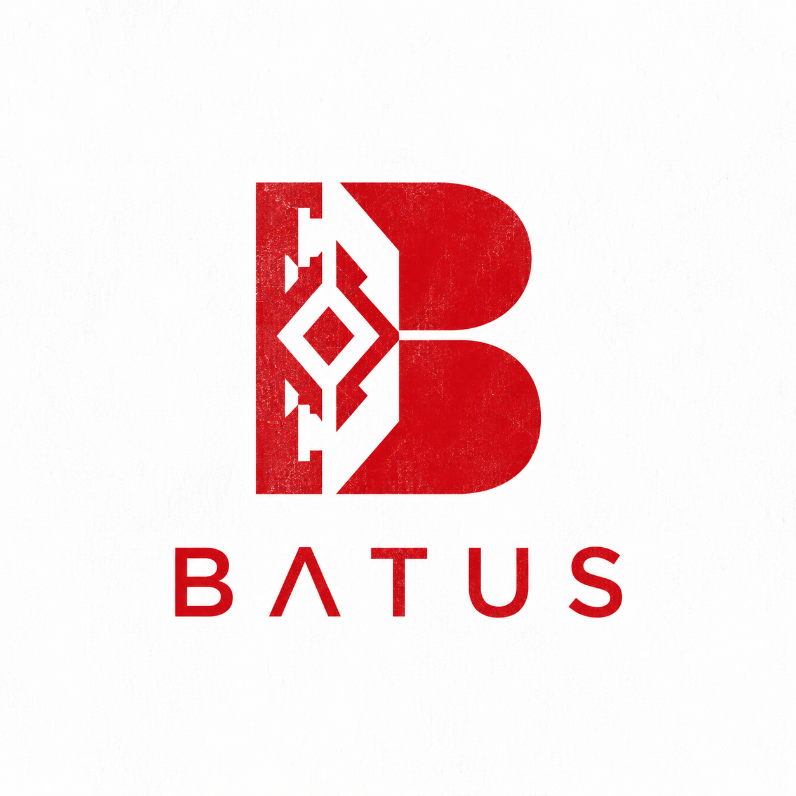
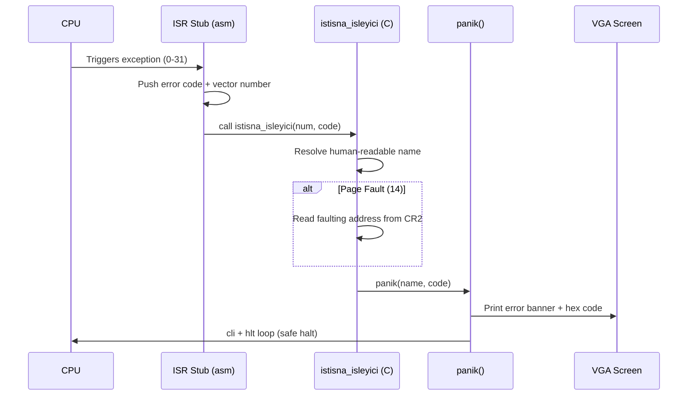
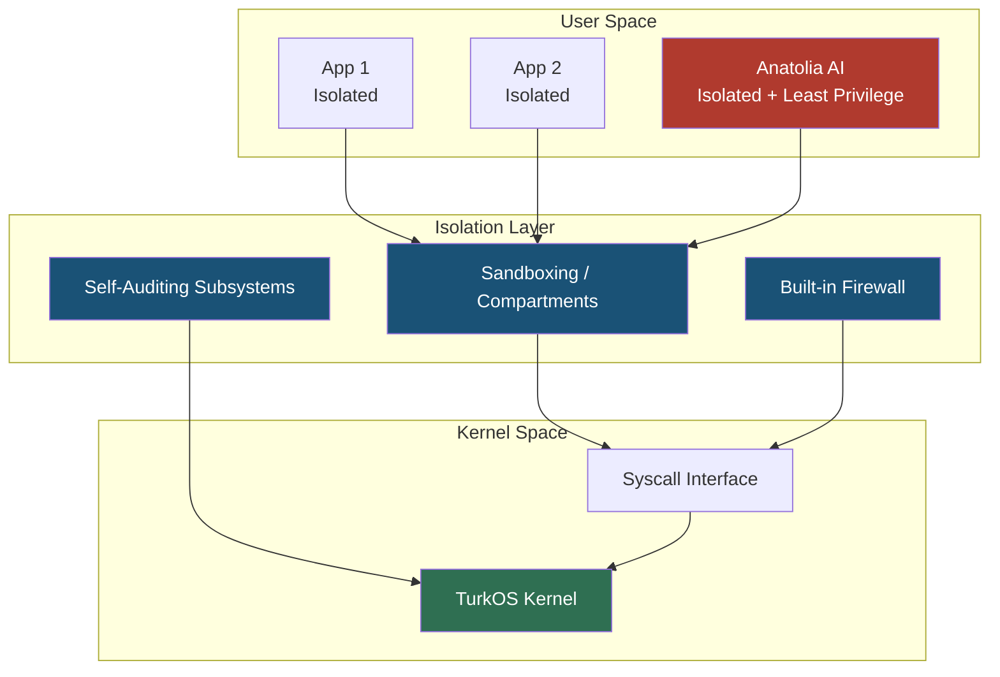
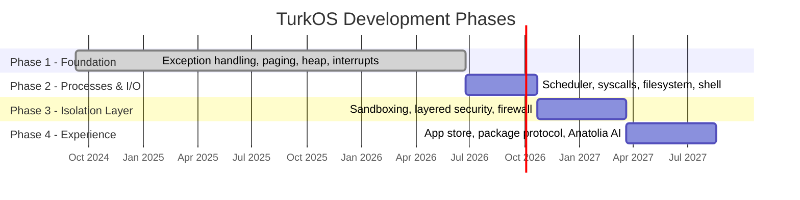

# TurkOS

<p align="center">
  
</p>

<p align="center">
  <strong>A day will come, and a day will end.</strong>
</p>

<p align="center">
  
  
  
  
  
</p>

---

## What is TurkOS?

TurkOS is an independent, open-source operating system written from scratch — bootloader, kernel, memory manager, drivers, all of it. No Linux kernel underneath, no BSD lineage. Just bare metal and a lot of stubbornness.

It is written using **öz Türkçe** (pure Turkish) identifiers throughout the codebase — function names, variable names, struct fields — as a deliberate design choice. It's both a statement of identity and a small act of defiance against the assumption that systems code has to read in English to be taken seriously. Comments, commit messages, and documentation are in English so the project stays approachable to the global open-source community; the code itself speaks Turkish.

## Origin

The project was started independently by **Batuhan ALGÜL** on **September 9, 2024**. Development began privately; the public GitHub history starts later and does not reflect the full timeline — what you see here is the open-source mirror of ongoing work, not the whole story from day one.

**[Batuss](https://batuss.com)** later joined as a partner on the project. TurkOS remains open source; some adjacent tooling and the more security-sensitive variants described below will not be.

Built in **İstanbul, Türkiye**.

| | |
|---|---|
| Personal site | [batuhanalgul.com](https://batuhanalgul.com) |
| Company | [batuss.com](https://batuss.com) |
| Started | September 9, 2024 |
| Location | İstanbul, Türkiye |

## Current state

This is a hobby-grade, early-stage kernel. Don't let the ambition in the sections below make you think otherwise — here is what actually exists today, measured against what's planned.


| Component | Status |
|---|---|
| Multiboot bootloader | Implemented |
| GDT / TSS | Implemented |
| IDT + all 32 CPU exception handlers | Implemented |
| Kernel panic handler | Implemented |
| Paging (16MB identity-mapped) | Implemented |
| Heap allocator (`kmalloc`/`kfree` with coalescing) | Implemented |
| PIT timer + PS/2 keyboard (IRQ0/IRQ1) | Implemented |
| VGA text-mode driver | Implemented |
| Process management / scheduler | Cooperative task switching implemented; preemptive scheduling not started |
| Syscall interface (int 0x80) | Implemented |
| Filesystem | Not started |
| Shell | Not started |
| Any form of sandboxing/isolation | Not started |

If a section below describes something the table doesn't list as implemented, it's **vision, not shipped code.**

## Exception handling — how a fault gets handled today



Before this existed, any unhandled fault triple-faulted the machine silently. Now every one of the 32 CPU exceptions resolves to a readable panic screen.

## Vision — where this is going

The long-term goal is an operating system that feels as approachable as macOS day-to-day, but is architected from the ground up the way Qubes OS thinks about isolation: every application/window runs in its own compartmentalized environment, so that one compromised app can't see or touch another.



Planned pillars:

| Pillar | Description |
|---|---|
| Layered security architecture | Isolation as a default, not an add-on bolted on later. |
| Self-auditing subsystems | The system watches its own subsystems for anomalous behavior across multiple domains — process behavior, memory access patterns, filesystem integrity, network activity — not just a single bolted-on scanner. |
| Own app store & distribution protocol | A vetted, signed package format and store, not an open free-for-all install pipeline. |
| Own firewall | Built into the kernel, not an optional userspace add-on. |
| Resource-conscious by design | Efficient on modest hardware, not just on the latest silicon. |
| Standard OS lifecycle done right | Shutdown, reboot, sleep — the boring stuff that has to be rock solid. |

### Anatolia AI

A planned, closed-source AI layer embedded in the OS, designed to be addressed by voice and to carry out system-level actions on the user's behalf.

**Important design note:** "voice-controlled system layer" does not mean "unsupervised root access." If it ships, it ships behind the same least-privilege, sandboxed model as everything else in the diagram above — an AI with a live microphone and command execution is exactly the kind of component a security-first OS has to be most paranoid about, not least.

### TurkOS-Boz

A planned, fully closed-source hardened fork of TurkOS aimed at high-assurance environments, going considerably further than the public OS in isolation and audit guarantees. No institutional affiliation exists today — this is a roadmap item, not an announcement of one.

## Roadmap — four phases



| Phase | Focus | Status |
|---|---|---|
| 1 — Foundation | Stable kernel primitives: exceptions, memory management, interrupts | In progress |
| 2 — Processes & I/O | Scheduler, syscalls, basic filesystem, shell | Planned |
| 3 — Isolation Layer | Per-application sandboxing, layered security model, firewall | Planned |
| 4 — Experience | App store, package protocol, Anatolia AI integration, polish | Planned |

## Building

Cross-compiler toolchain (`i686-elf-gcc/as/ld`) + `qemu-system-i386` for testing. Build instructions and a proper `Makefile` are coming as the build system matures — for now, see the commit history for the manual build commands used during development.

## Contributing

Issues, PRs, and discussion are welcome. Code identifiers stay in Turkish; comments, commit messages, and PR descriptions in English, please — that's what keeps this both authentically ours and usable by anyone who wants to dig in.

---

<p align="center"><em>A day will come, and a day will end.</em></p>


## Reality Check: Hardening the Patrol System / Gerceklik Kontrolu

Three honest engineering challenges were raised about the patrol (devriye) design, and each one is addressed in code rather than left as a known limitation:

**1. Polling race window** - the patrol originally only checked alarm counts every 50 ticks, leaving a window where a fast exploit could finish between checks. Fixed: denetim_otobusu.c now calls devriye_olay_bildirildi() immediately whenever any watcher raises an ALARM, so detection is event-driven, not just periodic. The periodic tick still runs for status logging, but the lockdown decision no longer waits for it.

**2. False positives from noisy-but-harmless code** - a single buggy (not malicious) program repeatedly mis-allocating memory shouldn't be enough to lock down the whole system. Fixed: devriye.c tracks a rolling "suspicion count" that decays after SUPHE_SOGUMA_SURESI (200 ticks) of quiet. Only a sustained burst of alarms within that window crosses the lockdown threshold - isolated, spaced-out issues age out instead of accumulating forever.

**3. Self-protection of the patrol's own state** - if an attacker could reach into kernel memory and patch devriye_kilitlendi_mi() to always return false, the whole mechanism would be worthless. Mitigated: lockdown state is stored as two variables (sistem_kilitli_a/b) where the second is an XOR-derived integrity tag of the first. devriye_kilitlendi_mi() checks this pairing on every call; if only one half was tampered with, the mismatch is detected and the system is forced into lockdown rather than trusting the corrupted value. This is a mitigation, not a full solution - real protection of Ring 0 memory ultimately requires write-protecting kernel data pages, which is on the longer-term roadmap.

Bu uc nokta - yoklama bosluklari, yanlis alarmlar ve denetleyicinin kendisinin hedef olmasi - gercek bir cekirdek guvenlik katmaninin asmasi gereken donanim seviyesindeki zorluklardir. Yukaridaki degisiklikler bu sorunlari kagit uzerinde degil, kodda ele alir.

## Building / Derleme

**macOS / Linux / WSL2:**
```bash
./batuss-derle.sh --calistir
```
Requires the i686-elf cross-compiler toolchain and QEMU. The script checks for both and prints install instructions if missing; it also forces UTF-8 locale env vars so the Turkish-character file paths build consistently regardless of your shell's default locale.

**Windows (native):**
```
batuss-derle.bat
```
This requires WSL2 (wsl --install in an admin PowerShell) and forwards the build into it automatically.

## License / Lisans

TurkOS is source-visible: anyone may read, fork, and submit Pull Requests. **Commercial use requires prior written permission from Batuss.** This Software and the TurkOS brand are ultimately and exclusively owned by the Batuss brand.

TurkOS kaynak-görünür bir projedir: herkes kodu inceleyebilir, fork edebilir ve Pull Request gönderebilir. **Ticari kullanım için Batuss'tan önceden yazılı izin alınması şarttır.** Bu Yazılım ve TurkOS markası, nihai ve münhasır olarak Batuss markasına aittir.

- Türkçe: [LICENSE.md](LICENSE.md)
- English: [LICENSE.en.md](LICENSE.en.md)
